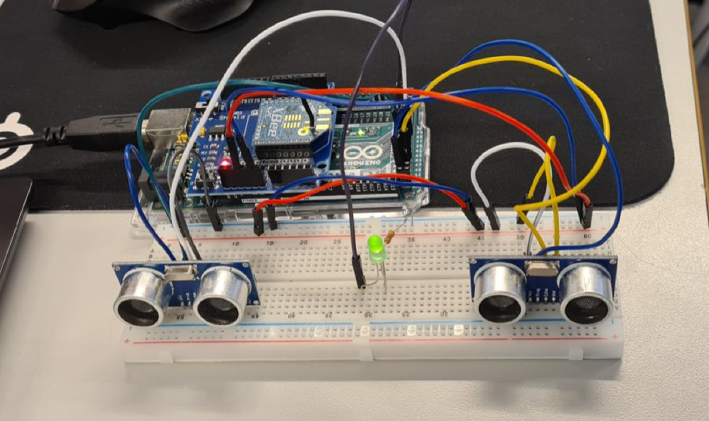

# Dataoverførsel til MQTT broker via Xbee wifi
## Registrering af butiks besøgs tal med ultralydssensor

## Beskrivelse
Projektet er skrevet som afsluttende opgave på hovedforløb 4 under uddannelsen som datatekniker med speciale i programmering. 
Opgavens formål er at vise forståelse for IOT, samt kendskab til teknologierne og redskaberne der benyttes i embedded programmering. 
 
Fuld dokumentation af projektet ligger som rapport i mappen "Materialer".

1. Dokumentationen ligger i Docx og PDF format i Materiale mappen.
2. Arduino projekt koden ligger i Arduino mappen.
3. Python scriptet til publicering af Xbee beskeder ligger i Raspberry mappen.
